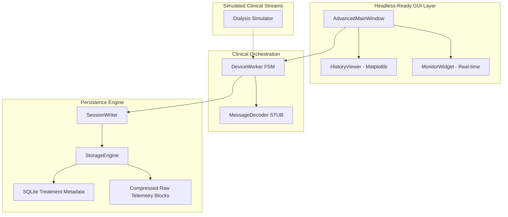

# ClinicalStream Orchestrator: Professional Extracorporeal Data Gateway


**ClinicalStream Orchestrator** is a high-performance orchestration engine designed for real-time telemetry management in **Extracorporeal Blood Purification** environments. Originally architected for the **Baxter Prismaflex** data ecosystem, this project demonstrates professional-grade handling of mission-critical data streams from Continuous Renal Replacement Therapy (CRRT) machines.

> [!CAUTION]
> **DISCLAIMER:** This project is a sanitized engineering showcase. It contains **NO proprietary clinical algorithms**, binary parsing logic, or patient data. All core clinical IPs have been replaced with architectural stubs. It is NOT a medical device and should NEVER be used in a clinical setting.

---

## 🏥 Clinical Context & Domain Expertise

This project showcases advanced engineering patterns required for complex clinical monitoring:
- **CRRT Telemetry**: Specialized handling for multi-vector pressure sensors (Access, Filter, Return, Effluent) and flow rate auditing (Blood, Dialysate, Replacement).
- **High-Integrity Messaging**: Fault-tolerant socket management designed for the noise and intermittent connectivity of clinical serial-over-IP networks.
- **Regulatory-Ready Patterns**: Implements structured logging and 2-tier storage suitable for audit-trail compliance in clinical research.

---

## 🏗️ System Architecture (4-Layer Decoupling)

The orchestrator follows a strict decoupled pattern to ensure zero-latency monitoring across multiple parallel device streams.



### Key Engineering Standards
- **FSM Treatment Lifecycle**: Finite State Machine ensuring data integrity from **PREPARATION** through **RUNNING** to **FINALIZATION**.
- **12s Buffer Persistence**: Optimized flush strategy to minimize disk I/O while guaranteeing data recovery during power failure events.
- **Multithreaded Isolation**: Each device connection runs in an isolated thread, preventing UI lag or cross-device interference.

---

## 🚀 Specialized Features

- **Dynamic Parameter Filtering**: Adaptive UI that prioritizes critical dialysis metrics (TMP, ΔP, Pressure Drops) based on active treatment status.
- **Compressed Raw Archival**: Stream-optimized storage using rotating raw segments and SQLite relational indices for sub-second retrieval.
- **Integrated Clinical Simulator**: High-fidelity stream generator for validating interface responsiveness without hardware connectivity.

---

## 🛠️ Technology Stack

- **Core Engine**: Python 3.11+
- **GUI Framework**: PySide6 (Qt for Python)
- **Data Analytics**: Pandas & Matplotlib
- **Storage**: SQLite3 / Gzip Stream Compression
- **Methodology**: Test-Driven Development (TDD) via PyTest

---

## 📊 Performance Benchmarks

Designed for the rigors of 24/7 ICU monitoring:
- **Concurrency**: Tested with 10+ simultaneous device streams.
- **Latency**: Sub-300ms packet transformation path.
- **Throughput**: ~5:1 compression ratio for sustained raw clinical data.
- **Reliability**: Automatic state-restoration logic for network gap recovery.

---

## 📁 Repository Structure

```text
ClinicalStream-Orchestrator/
├── src/
│   ├── main.py                 # System Bootstrap
│   ├── core/                   # The Orchestration Backbone
│   │   ├── advanced_device_worker.py  # FSM Engine Logic
│   │   ├── storage_engine.py          # Dual-Tier Persistence
│   │   ├── message_decoder.py         # [SANITIZED] Protocol Stubs
│   │   └── clinical_simulator.py      # [PORTFOLIO] Stream Logic
│   └── gui/                    # Professional Visualization Layer
├── docs/                       # Technical Specification Guides
├── tests/                      # Architectural Integrity Suites
└── README.md
```

---

*Engineered by DinhLucent - Advancing Technical Standards in Extracorporeal Data Systems.*
