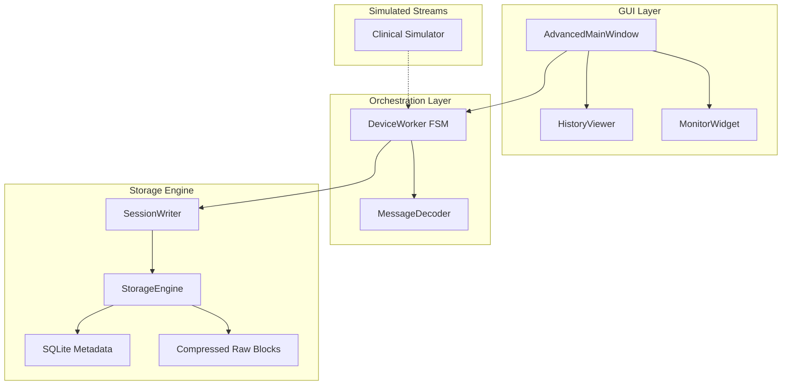

# ClinicalStream-Orchestrator: High-Performance Medical Data Stream Manager


**ClinicalStream Orchestrator** is a professional, high-performance orchestration engine designed to manage and monitor real-time data streams from complex clinical devices. This project showcases a robust 4-layer architecture, asynchronous device management, and high-integrity data storage patterns suitable for mission-critical clinical environments.

> [!CAUTION]
> **DISCLAIMER:** This project is a sanitized engineering demonstration. It contains NO proprietary clinical algorithms, device-specific control logic, or sensitive patient data. It is intended for software architecture review and portfolio purposes ONLY. It is NOT a medical device and should never be used in a clinical setting.

---

## 🏗️ System Architecture

The project follows a strict 4-layer decoupling pattern to ensure stability and parallel processing of multiple device streams.



### Key Engineering Patterns
- **FSM Treatment Lifecycle**: Implements a Finite State Machine for reliable monitoring (IDLE → PREPARE → RUNNING → FINALIZING → COMPLETE).
- **Packet Handling**: High-efficiency binary parsing with CRC validation and sequence tracking.
- **2-Tier Storage**: 
  - **Raw Segments**: Compressed binary blocks for high-throughput stream preservation.
  - **Relational Metadata**: SQLite indices for rapid querying of alarms, headers, and treatment gaps.
- **Multi-Device Parallelism**: Thread-safe worker orchestration with isolated performance monitoring per socket connection.

---

## 🚀 Core Features

- **Real-time Monitoring**: Multi-threaded GUI (PySide6) with dynamic parameter filtering and custom favorite tracking.
- **Offline Post-Processing**: Integrated offline decoder for high-resolution timeline visualization using Matplotlib.
- **Fault Tolerance**: Automatic reconnection logic with precise "gap tracking" to ensure data integrity across network interruptions.
- **Adaptive Thresholds**: Dynamic parameter filtering based on device status and treatment type.

---

## 🛠️ Technology Stack

- **Engine**: Python 3.9+
- **GUI Framework**: PySide6 (Qt for Python)
- **Data Handling**: SQLite3, Pandas, Gzip (Raw Compression)
- **Visualization**: Matplotlib
- **Testing**: PyTest / Unittest
- **DevOps**: Conda Environment, PowerShell Launchers

---

## 📊 Performance Targets

The orchestrator is designed to handle high-frequency data packets with the following benchmarks:
- **Packet Jitter Tolerance**: < 50ms variance.
- **Storage Latency**: 12s flush buffer to minimize disk I/O overhead.
- **Compression Efficiency**: ~5:1 ratio for raw clinical data streams.
- **UI Refresh**: Sub-second synchronization across all active device windows.

---

## 📁 Repository Structure

```
ClinicalStream-Orchestrator/
├── src/
│   ├── main.py                 # Application Bootstrap
│   ├── core/                   # Orchestration Logic
│   │   ├── advanced_device_worker.py  # FSM Engine
│   │   ├── storage_engine.py          # 2-Tier Persistence
│   │   ├── message_decoder.py         # Binary Parsing Stubs
│   │   └── clinical_simulator.py      # Stream Mocking
│   └── gui/                    # UI Implementation
├── configs/                    # JSON Schema & Presets
├── schema/                     # Persistence Layer SQL
├── tests/                      # Architectural Validation
└── CLINICAL_WORKFLOW_GUIDE.md  # Detailed Engine Internals
```

---

## 📝 Usage Documentation

- [Quick Start Guide (Conda)](QUICK_START_CONDA.md)
- [Workflow & State Machine Guide](CLINICAL_WORKFLOW_GUIDE.md)
- [Monitor Features Summary](MONITOR_FEATURES_SUMMARY.md)

---

## 📜 License

Distributed under the MIT License. See `LICENSE` (to be added) for more information.

---

*Engineered by DinhLucent - Focused on Architectural Excellence in Medical Software.*
